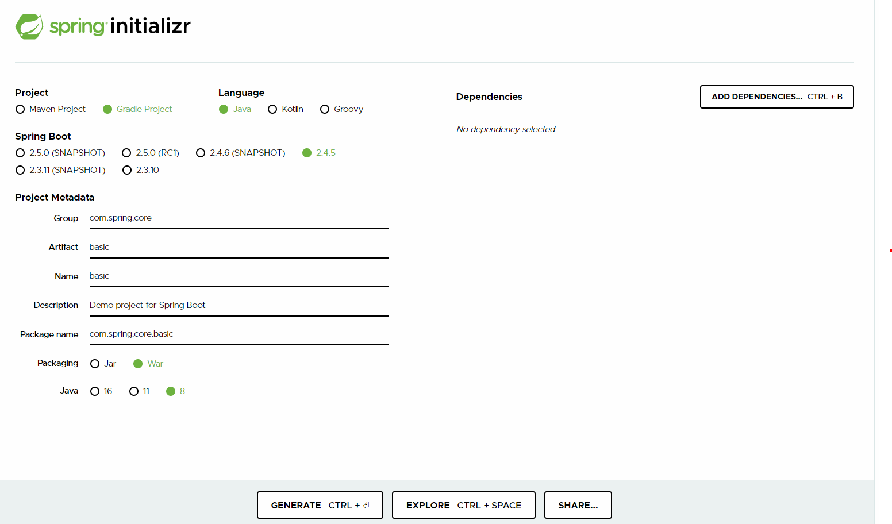

# 스프링 코어 학습
- [스프링 프로젝트 설정 링크](http://start.spring.io)
- 

## lombok 설정
1. build.gradle - dependencies에 추가
```groovy

//lombok 라이브러리
compileOnly 'org.projectlombok:lombok:1.18.12'
annotationProcessor 'org.projectlombok:lombok:1.18.12'
```

2. 인텔리제이 플러그인 lombok 설치
3. 설정에 annotation processor 검색 ->  아노테이션 활성화 체크